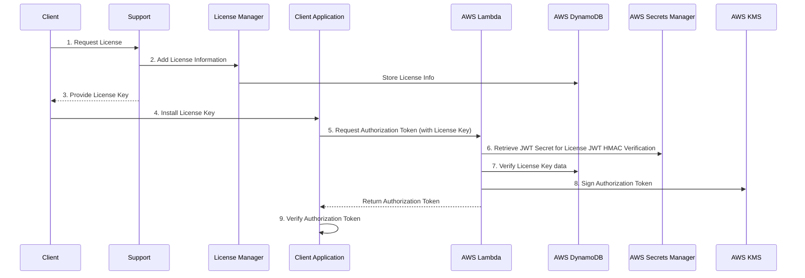

# Architecture

The Open Licenser solution employs a robust and highly available server-side architecture leveraging AWS services. This design ensures reliable license management and verification for Mendix modules and widgets.

## Key Components
### Server side
   1. **[AWS Lambda](https://aws.amazon.com/lambda/)**
      - Provides serverless compute capabilities
      - Guarantees 99.95% uptime
      - Handles license verification and authorization token generation

   2. **[AWS DynamoDB](https://aws.amazon.com/dynamodb/)**
      - Serverless NoSQL database service
      - Guarantees 99.999% uptime
      - Stores license information and client data
      - Enables quick and efficient license lookups

   3. **[AWS Secrets Manager](https://aws.amazon.com/secrets-manager/)**
      - Securely stores and manages secrets
      - Used to store the JWT signing key for license verification

   4. **[AWS Key Management Service (KMS)](https://aws.amazon.com/kms/)**
      - Manages cryptographic keys
      - Used for signing the authorization tokens

   5. **[Open Licenser](openlicenser-userguide.md)**
      - Custom Mendix application for managing licenses
      - Interfaces with AWS DynamoDB to store and update license information

### Client side
   1. **[org.capegroep.licensemanager](java-module.md)**
      - Request authorization token to the license server every day
      - Verify authorization token
      - Exponential back-off if license server is inactive
      - API to allow/deny "critical function" to run
   2. **[LicenseVerificator](license-verificator.md)**
      - Mendix wrapper for `org.capegroep.licensemanager`
      - Get license validation result, authorization token, license information, and error message to mendix 
   3. **[AuthorizationTokenReader](authorization-token-reader.md)**
      - For mendix pluggable widget in typescript
      - Verify authorization token on browser, specially for widget
      - Authorization token still need to be provided by the java module
      - API to allow/deny "critical function" to run

## Architecture Flow

The following diagram illustrates the architecture flow of the solution:

1. **License Request**:
   - Client requests a license from Support
   - Support checks for agreement/EULA compliance

2. **License Information Addition**:
   - If the client has a valid agreement, Support adds license information via the License Manager
   - License Manager stores this information in AWS DynamoDB

3. **License Key Provision**:
   - Support provides the client with a [license key](data-structure.md#license-key)
   - The license key is an HMAC-signed JWT token

4. **License Key Installation**:
   - Client installs the [license key](data-structure.md#license-key) into their application

5. **Authorization Token Request**:
   - The client application requests a [authorization token](data-structure.md#authorization-token) from AWS Lambda
   - The [license key](data-structure.md#license-key) is included as input in this request

6. **JWT Secret Retrieval**:
   - AWS Lambda retrieves the JWT secret from AWS Secrets Manager for license key verification

7. **License Verification**:
   - AWS Lambda verifies the [license key](data-structure.md#license-key) against information stored in AWS DynamoDB and against the HMAC from AWS Secret manager

8. **Authorization Token Generation and Signing**:
   - If verification is successful, AWS Lambda generates a [authorization token](data-structure.md#authorization-token)
   - The [authorization token](data-structure.md#authorization-token) is signed using AWS KMS with RSA

9. **Authorization Token Verification**:
   - The [authorization token](data-structure.md#authorization-token) is verified inside the client application through the java module plus the widget module

## Benefits of this Architecture

1. **Secure**: Utilizes JWT tokens with different signing methods for [license keys](data-structure.md#license-key) (HMAC) and authorization tokens (RSA)
2. **Flexible**: Supports various licensing models and terms
3. **Scalable**: Serverless architecture allows efficient handling of varying loads
4. **High Availability**: AWS Lambda and DynamoDB provide near-constant availability for license checks
5. **Real-time Management**: Enables immediate updates to licensing information
6. **Cost-Effective**: Pay-as-you-go model for both compute (Lambda) and storage (DynamoDB) resources
7. **Enhanced Security**: Utilizes AWS Secrets Manager for secure storage of sensitive information and AWS KMS for robust key management and signing

## Integration with Open Licenser license manager

The [Open Licenser](openlicenser-userguide.md) Mendix application integrates with the server-side architecture, allowing Support to:
- Add and manage license information
- Generate [license keys](data-structure.md#license-key)
- Synchronize license data with AWS DynamoDB

This integration ensures accurate and up-to-date licensing information for verification purposes.

## Future Considerations

Potential future enhancements include:
- Implementing caching mechanisms to reduce database reads
- Adding analytics capabilities for usage insights
- Exploring multi-region deployment for reduced latency in global scenarios
- Implementing automatic key rotation using AWS KMS for enhanced security

By leveraging AWS services and implementing this secure, token-based licensing system, the Licenser Module provides a robust solution for Mendix developers to manage and monetize their custom modules and widgets.