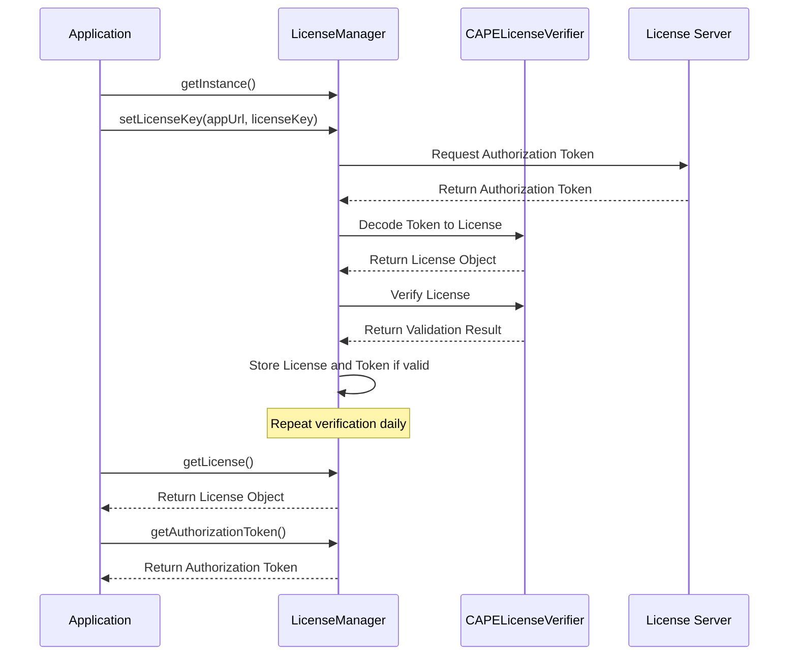

# Java Module

## Overview

The `org.capegroep.licensemanager` package provides a robust solution for license management in Java applications. It handles license verification, token management, and periodic checks to ensure continued validity.

In the case of mendix application, we also provide a mendix module that serves as an entry point.

## Resources
- `/resources/java-module/org/capegroep/LicenseManager`

## Getting Started

### 1. Initialize the LicenseManager

The entry point for the package is the `LicenseManager` class. To get an instance:

```java
LicenseManager licenseManager = LicenseManager.getInstance();
```

### 2. Set the License Key

During application startup, set the license key:

```java
URL appUrl = new URL("https://your-app-url.com");
String licenseKey = "your-license-key-here";
licenseManager.setLicenseKey(appUrl, licenseKey);
```

This initiates the license verification process.

### 3. Retrieve License Details

To get the license details:

```java
License license = licenseManager.getLicense();
```

### 4. Get the Authorization Token

To retrieve the current authorization token:

```java
String authToken = licenseManager.getAuthorizationToken();
```

## Protecting Critical Functions

To protect critical functions in your application using the license manager, you can check the validation result before executing the function. Here's an example:

```java
public class CriticalOperations {

    private final LicenseManager licenseManager;

    public CriticalOperations() {
        this.licenseManager = LicenseManager.getInstance();
    }

    public void performCriticalOperation() {
        Result validationResult = licenseManager.getValidationResult();
        
        if (validationResult.getResult()) {
            // License is valid, proceed with the critical operation
            executeCriticalOperation();
        } else {
            // License is invalid, handle accordingly
            handleInvalidLicense(validationResult.getMessage());
        }
    }

    private void executeCriticalOperation() {
        // Your critical operation logic here
        System.out.println("Executing critical operation...");
    }

    private void handleInvalidLicense(String errorMessage) {
        // Handle the invalid license scenario
        System.err.println("Cannot perform critical operation. License error: " + errorMessage);
        // You might want to log this, notify the user, or take other appropriate actions
    }
}
```

In this example:

1. We create an instance of `LicenseManager` in the constructor of our `CriticalOperations` class.
2. Before performing any critical operation, we check the validation result using `licenseManager.getValidationResult()`.
3. If the result is valid (`getResult()` returns true), we proceed with the critical operation.
4. If the result is invalid, we handle the scenario appropriately, using the error message from the validation result.

You can call this method in your application like this:

```java
CriticalOperations operations = new CriticalOperations();
operations.performCriticalOperation();
```

This approach ensures that critical functions are only executed when a valid license is present, protecting your intellectual property and ensuring proper usage of your software.

## Important Details

### Updating verification server url

1. Note down your lambda verificator url
2. Locate the `VERIFICATION_SERVER_URL` constant in `LicenceManager.java`
3. Update the value


### Updating the Public Key

The public key used for verification is stored in the `CAPELicenseVerifier` class. To update it with the public key from AWS KMS:

1. Locate the `PUBLIC_KEY` constant in `CAPELicenseVerifier.java`
2. Replace its value with the new public key from AWS KMS

```java
private static final String PUBLIC_KEY = "-----BEGIN PUBLIC KEY-----\n" +
    "Your new public key here..." +
    "-----END PUBLIC KEY-----";
```

### Changing the License Verification Period

The license is verified daily by default. To change this period:

1. Open `LicenseManager.java`
2. Locate the `startVerificationService()` method
3. Modify the `scheduleAtFixedRate` call:

```java
taskHandle = scheduler.scheduleAtFixedRate(dailyAuthorizationTokenVerificationTask,
        1, YOUR_DESIRED_PERIOD, YOUR_DESIRED_TIMEUNIT);
```

Replace `YOUR_DESIRED_PERIOD` and `YOUR_DESIRED_TIMEUNIT` with your preferred values.

## Error Messages

The package uses a `Result` class to convey the status of operations. Some potential error messages include:

- `"NOT_INITIALIZED"`: The license manager hasn't been properly initialized
- `"LICENSE_NOT_FOUND"`: The license key or app URL is missing
- `"INVALID_SERVICE_ID"`: The service ID doesn't match the expected value
- `"LICENSE_EXPIRED"`: The license has expired
- `"INVALID_APPURL"`: The app URL doesn't match the allowed URLs in the license
- `"CONNECTION_WITH_LICENSE_SERVER_FAILED"`: Unable to connect to the license server
- `"INTERNAL_ERROR"`: An internal error occurred during license verification

## Package Workflow

The following diagram illustrates the general workflow of the package:



This package provides a secure and efficient way to manage licenses in your Java application, with built-in features for periodic verification and error handling.
