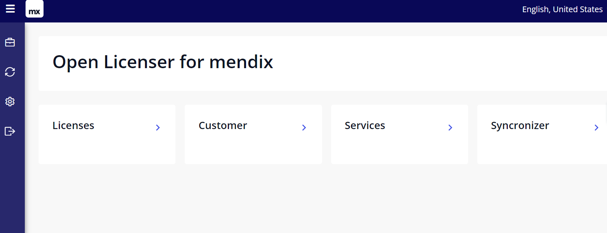
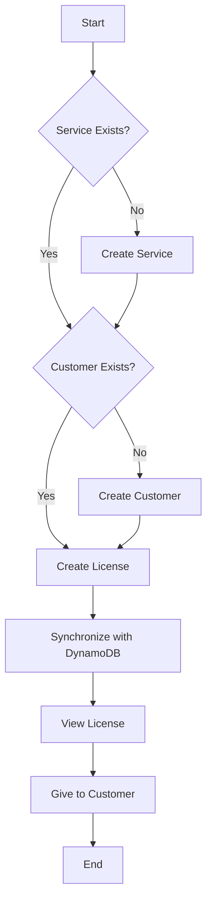
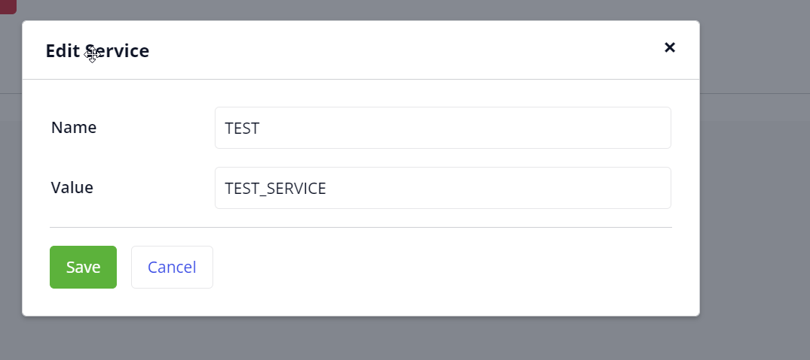
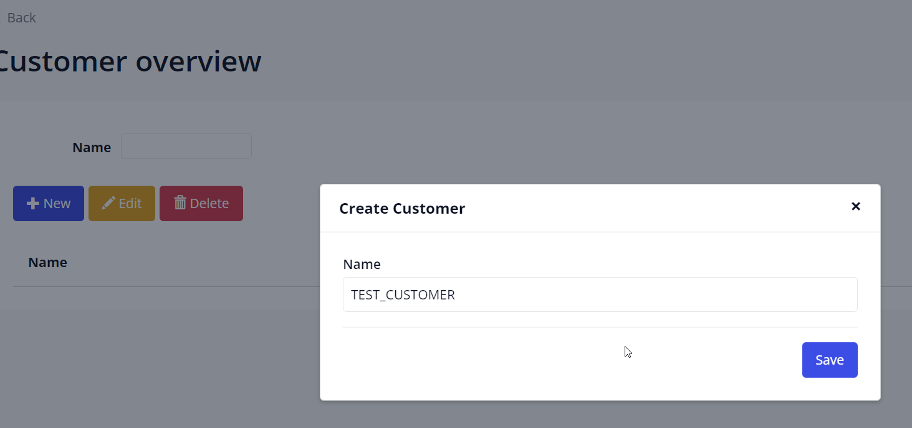
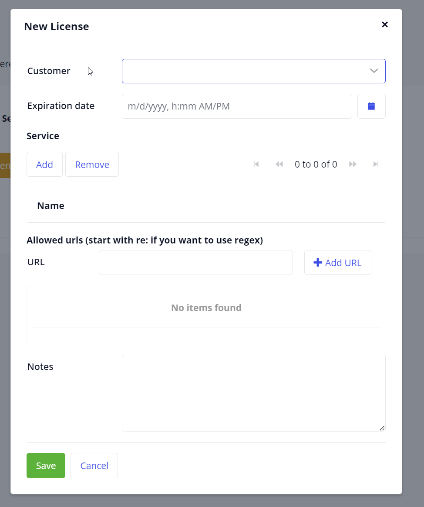

# Open Licenser User Guide

Open Licenser is a LicenseManager implementation built in Mendix. Its main purpose is to manage licenses in DynamoDB.

## Application Modules

The application consists of several modules:

1. **LicenseManager**: CRUD operations for Licenses Information.
2. **LicenseVerificator**: Mendix Wrapper for Java-module.
3. **LicenseSyncronizer**: Functionality to synchronize with AWS DynamoDB.
4. **ServiceManager**: Manage services in licenses.
5. **CustomerManager**: Manage License Customers.

## Business Process for Support

Here's a mermaid chart illustrating the business process for support:

## Detailed Process

### 1. Create Service (if not exist)

1. From Home, click "Services"
2. From Service Overview, click "New"
3. Fill in the service name and the service identifier (value)

4. Double-check in service overview

### 2. Create Customer (if not exist)

1. From Home, click "Customer"
2. From customer overview click "New"
3. Fill in the customer name

4. Double-check in customer overview

**Note**: The customer module is barebone and for example only. Please add your own implementation, such as retrieving data from CRM.

### 3. Create License

1. From Home, click "License"
2. From license overview, click "New"

3. Select customer from drop-down
4. Add expiration date in the future
5. Select services (you can add more than 1 service in one license)
6. Add Application URLs (the license will be restricted to written domain; regex is also possible)
7. Add notes if necessary
8. Click "Save"
9. Select the created license
10. Click "View license"
11. Copy the license key and send it to the customer

### 4. Synchronize to AWS DynamoDB

1. From home, click "Synchronizer"

2. Click "Get license from AWS"
3. Inspect the to-be synchronized data, ensure everything is correct
4. Click "Synchronize all licenses to AWS"

By following these steps, you can effectively manage licenses using Open Licenser. Remember to always double-check the information and ensure proper synchronization with AWS DynamoDB.
